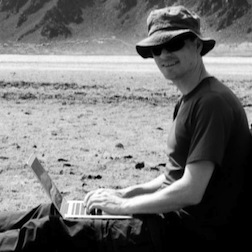




<h2><a href="archives.html">Older Posts</a><h2>

I am an associate professor of [applied mathematics](http://cemse.kaust.edu.sa/academic/programs/applied-mathematics-computational-science/default.aspx) at King Abdullah University
of Science and Technology ([KAUST](http://www.kaust.edu.sa)), where
I lead the [Numerical Mathematics Group](http://numerics.kaust.edu.sa).

My [research](http://numerics.kaust.edu.sa/research.html) involves
analysis and development of numerical methods for integration of ordinary
and partial differential equations, as well as the implementation of such methods
in [open source, accessible, high performance software](code.html)
and its application to understanding behavior of nonlinear waves in heterogeneous materials.

<ul class="unstyled" style="font-size:.8em;line-height=.8em">
<li style="margin:-6px"> Office: 4202 Al-Khawarizmi Building 
<li style="margin:-6px"> Email &amp; online networks: linked from icons below. </li>
</ul>

  

