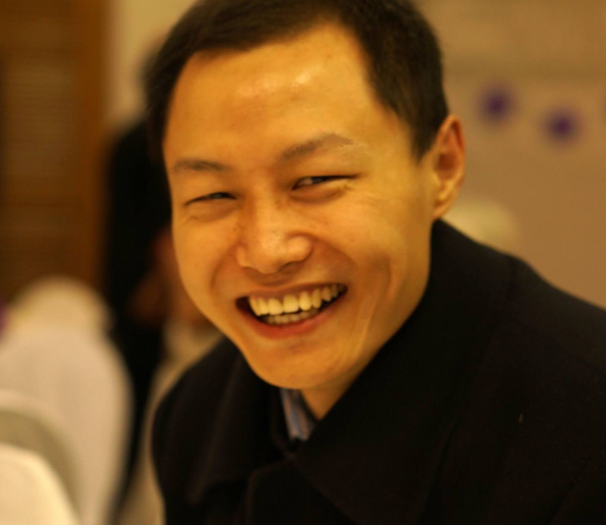

 
 

  
  
  

  

    

     <i class="icon-chevron-left"></i> <a href="/archives.html">Archives by date, </a>
     <i class="icon-list"></i> <a href="/categories.html">by category, </a>
     <i class="icon-tag"></i> <a href="/tags.html">by tag</a>
    

  

      

  

      <ul class="unstyled" style="font-size:.8em;line-height=.8em;background-color="transparent";">
        <li style="margin:-6px"> </img></li>
      </ul>
  

  

      
      <ul class="unstyled" style="font-size:.8em;line-height=.8em" align="left">
      <li style="margin:-6px"> Office: 30 Physics and Astronomy Department</li>
      <li style="margin:-6px">         1919 Lomas Blvd NE, Albuquerque, NM 87131, USA</li>
      <li style="margin:-6px"> </li>
    </ul>
      

       

           
           
           
           
           
           
             
       

       
<a href="/CV-XiaodongQi.pdf">CV of Xiaodong Qi</a>

    

      
  

 

 

 

  <b>Xiaodong Qi</b> (戚晓东) 

  

  </img>
  

  I am a PhD candidate of
  <a href="http://cquic.org">the Center for Quantum Information and Control (CQuIC)</a> at University of New Mexico (<a href="http://www.unm.edu">UNM</a>), where
  I am doing theoretical study with <a href="http://info.phys.unm.edu/~ideutsch">Prof. Ivan Deutsch</a>.

  Most of my time, I concentrate on <a href="/research.html">research</a>.
  I decode the mathematical rhythms of the dance of photons with matter (atoms, nano-scale objects and macro-scale photonic structures)--they are sometimes powerful, sometimes silky, in general harmonic, vivid, colorful, romantic and marvelous yet with a bit of mystery.
  My earliest study began with the energetic nature of light, and was discovering novel approaches to generate bright and coherent light in a given pace (frequency) based on the resonant play of light with well structured crystals and semiconductor structures.
  Later, I appreciate the other aspect of the light more than ever before, that is to employ weak light as the carry of information, and again via the dance with atoms on some nano-scale structures.
  I feel this study on few-photon and micro-scale platforms could open a door to a new era of information processing--namely, quantum information processing and communications.
  It will be precise, energe-efficient, intelligent and revolutionary in easing the lives of people and accelerating the evolution of human society.

  After years of serious studies on nature and rigorous trainings on critical thinking, I appreciate and enjoy my life more than ever before.
  Trains of thoughts on general philosophy and methodology are constantly examined in real life and are poured out on the internet and elsewhere with folks around me. Keep in touch!

  <!--
    
   -->
 

 

